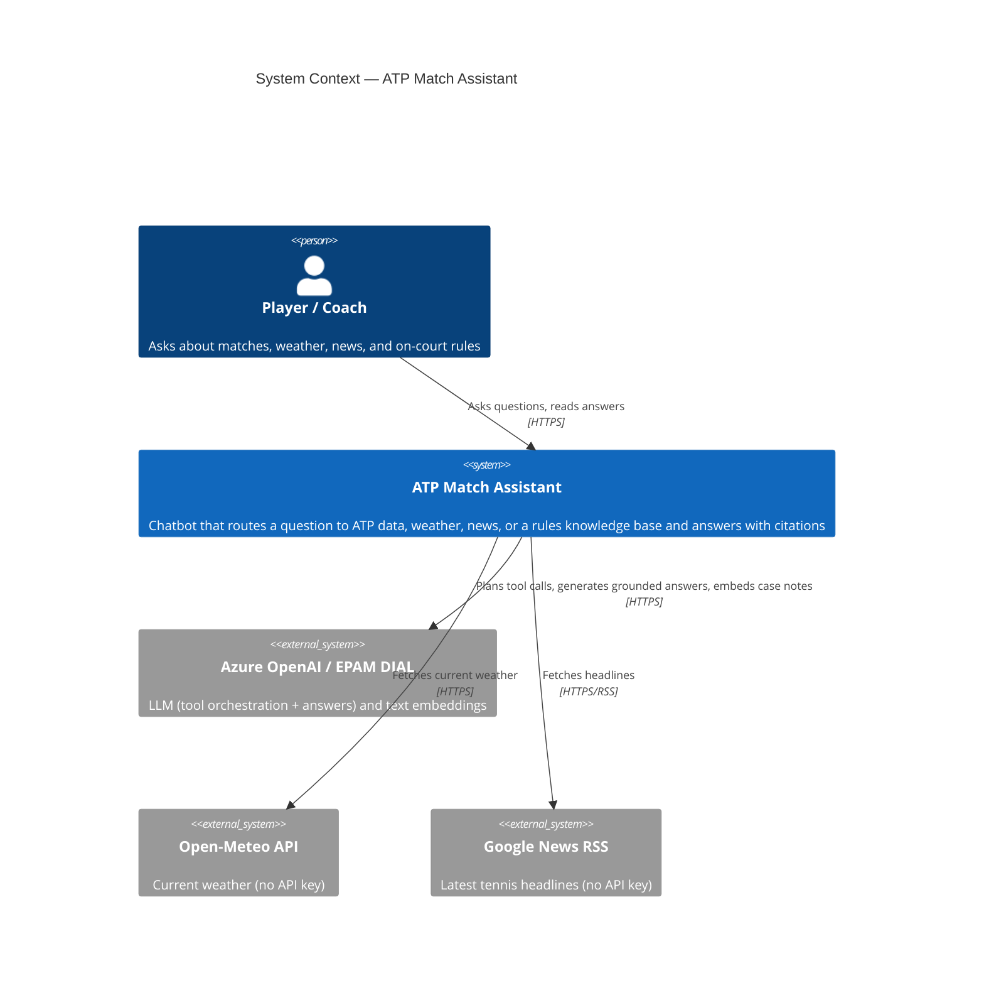
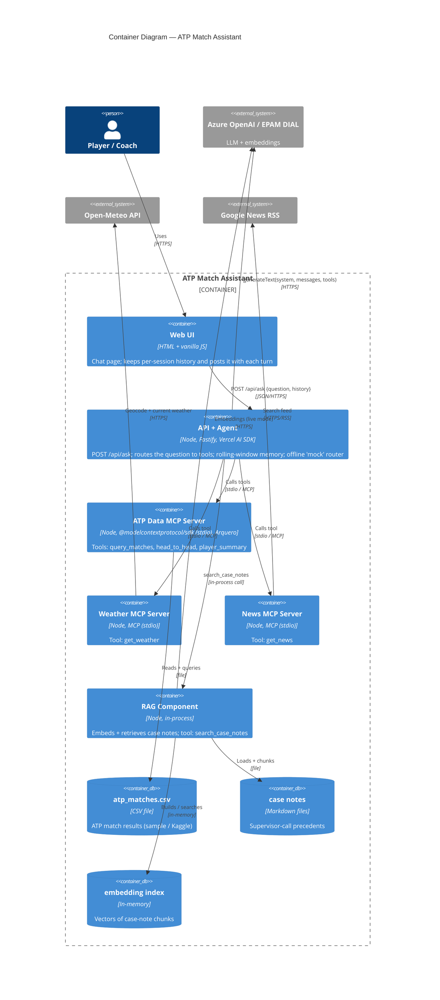
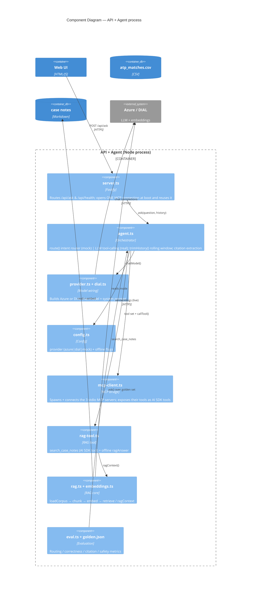
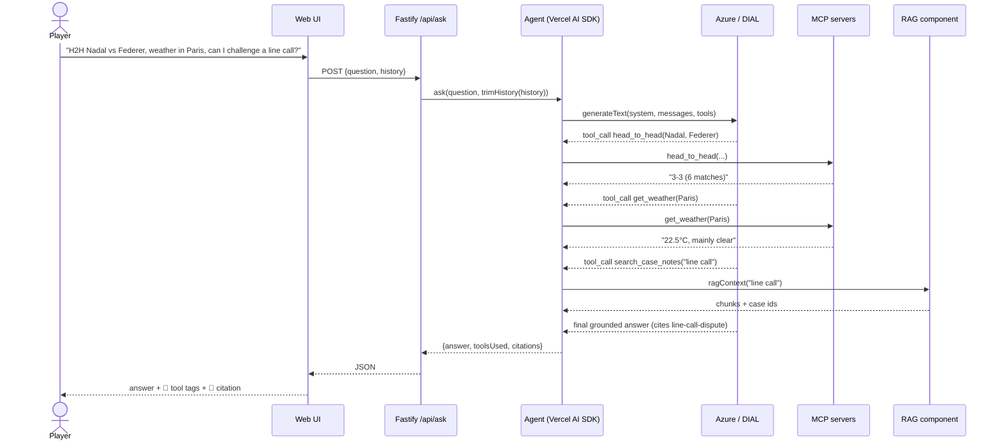
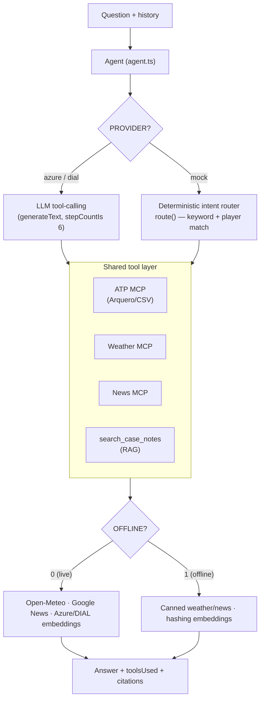

# Architecture — ATP Match Assistant

Technical architecture of the capstone, described with the **C4 model** (Context → Container → Component) plus a runtime sequence and a provider/mode view. Diagrams are Mermaid — they render on GitHub, in Obsidian, and in VS Code's Mermaid preview. A static `architecture.svg` is included for quick viewing.

---

## C4 Level 1 — System Context

Who uses the system and which external systems it depends on.

> Offline/mock mode replaces the three external systems with deterministic local logic, so the app, tests, and eval run with no keys and no network.

---

## C4 Level 2 — Containers

The deployable/runtime pieces and the data they read.

> **Note:** the RAG component runs **in-process inside the API + Agent container**; only the three MCP servers are separate processes. It is drawn as its own box here to make the retrieval path explicit. The static `architecture.svg` folds RAG into the API + Agent container (the more literal deployment view).

---

## C4 Level 3 — Components (inside "API + Agent")

How the agent process is wired internally.

---

## Runtime — multi-tool request (sequence)

A single question that fans out to data + weather + rules, in the live (LLM) path.

---

## Providers & execution modes

The same tool layer runs under three configurations (set in `.env`).

**Notes**

- **MCP is real in every mode** — tools are always invoked through the stdio MCP servers; only the *orchestrator* (LLM vs deterministic router) and the *data source* (live vs canned) change.
- **Swap points:** dataframe engine is isolated in `datatable.ts` (Arquero → Danfo.js); the LLM provider is one line in `provider.ts`/`dial.ts`; the news source is one function in `news.ts`.
- **Scaling note:** MCP servers are separate processes (here spawned over stdio); they could be deployed independently behind a network MCP transport without changing the agent.
