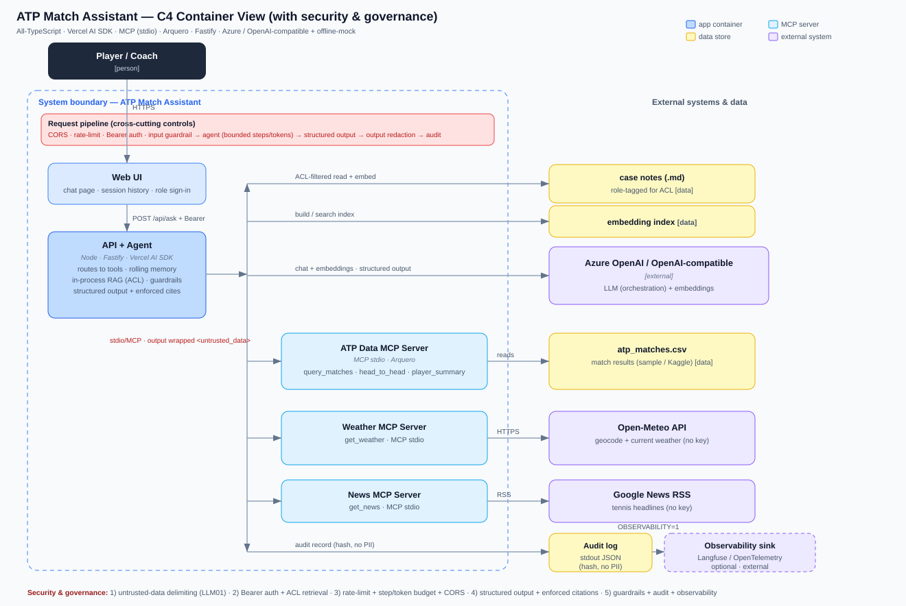

# ATP Match Assistant

A chatbot that composes a **RAG** knowledge base with an **agent + MCP tools**, extended with a **data-query MCP server** over an ATP matches CSV. You ask one question; an agent decides which source(s) to use and answers — with citations for rules questions.

Sources the agent routes between:

- **ATP data** (MCP) — head-to-head, player records, and filtered match search over a CSV, via a dataframe engine.
- **Weather** (MCP) — current conditions at a match venue (Open-Meteo, no key).
- **News** (MCP) — latest tennis news (Google News RSS, no key).
- **RAG** — grounded answers from a corpus of "problematic match / supervisor-call" case notes (line-call disputes, coaching violations, medical timeouts, code violations, when a supervisor is called), queryable by players, with citations.

**Stack:** All-TypeScript · Vercel AI SDK (agent) · `@modelcontextprotocol/sdk` (3 stdio MCP servers + clients) · Arquero (dataframe) · Vitest (tests) · Fastify + single-page chat UI · Azure / OpenAI-compatible + offline-mock providers.

## Quick start

```bash
npm install
cp .env.example .env   # defaults: PROVIDER=mock, OFFLINE=1 → no keys/network needed
npm test               # Vitest — hermetic, no live model
npm run eval           # evaluation metrics
npm run serve          # web chat UI → http://localhost:3000
npm run ask -- "head-to-head Nadal vs Federer and weather in Paris"   # CLI
npm run typecheck      # tsc --noEmit
```

## Configuration (`.env`)

| Variable | Values | Description |
|----------|--------|-------------|
| `PROVIDER` | `mock` (default) · `azure` · `dial` | `mock` = deterministic intent router, no LLM |
| `OFFLINE` | `1` (default) · `0` | `1` = canned weather/news, no network |

The MCP layer is real in every mode; `mock` + `OFFLINE=1` lets the whole app, tests, and eval run with no keys and no internet. With `azure`/`dial` the LLM does the tool orchestration and uses real embeddings.

**Conversation memory:** the web UI keeps per-session history and sends it with each turn, so follow-ups ("yes", "go on") keep context in the LLM path (`azure`/`dial`). To keep context size and cost bounded, the agent applies a **rolling window** server-side (`trimHistory`) — it keeps at most the last 12 turns *and* trims older ones once the history exceeds ~6,000 characters (~1.5k tokens), always retaining the most recent turns. The offline `mock` router is stateless (routes on the current message only).

### Run with Azure OpenAI

```ini
PROVIDER=azure
OFFLINE=0

AZURE_RESOURCE_NAME=your-resource
AZURE_API_KEY=your-api-key
AZURE_CHAT_DEPLOYMENT=gpt-4o-mini
AZURE_EMBED_DEPLOYMENT=text-embedding-3-small
```

### Run with an OpenAI-compatible gateway

For gateways that use Azure-style deployment URLs (`/openai/deployments/{model}/chat/completions`):

```ini
PROVIDER=dial
OFFLINE=0

DIAL_BASE_URL=https://your-gateway.example.com
DIAL_API_KEY=your-api-key
DIAL_API_VERSION=2024-02-15-preview
DIAL_CHAT_MODEL=gpt-4o-mini
DIAL_EMBED_MODEL=text-embedding-3-small
```

## Authentication & access control

`POST /api/ask` requires a **Bearer token** (auth is on by default; set `AUTH_DISABLED=1` to turn off for local dev). The token resolves to a user with **roles**, and the RAG retriever is **ACL-aware**: a case note is only retrievable if its `roles:` frontmatter intersects the user's roles (default `public`). Access control happens *before* scoring, so restricted notes never reach the model for unauthorized users.

Dev tokens (override via `AUTH_TOKENS` JSON in production): `player-token` (public), `official-token` (public + official), `admin-token` (all). The web UI has a "sign in as" selector; the CLI/eval run as a public/eval user.

Example — the same question, different role:

```
player-token   → cites public note  "supervisor-call"
official-token → cites restricted   "confidential-disciplinary"   (officials only)
```

## Grounded answers — structured output + enforced citations

In the live (Azure / OpenAI-compatible) path the agent returns a **typed object** — `{ answer, citations, refused }` — via the AI SDK's structured-output mode (`Output.object` + a Zod schema), instead of free text that has to be parsed. Citations are then **enforced**: only case ids that `search_case_notes` actually returned this turn are allowed, so the model cannot fabricate a source. If the model cites nothing but case notes were retrieved, the real sources are added; fabricated ids are dropped (`enforceCitations`, unit-tested). `refused=true` flags out-of-scope questions.

## Guardrails, audit logging & observability

- **Input guardrail** (`src/guardrails.ts`) — blocks obvious prompt-injection / jailbreak attempts before any tool/model work (defense-in-depth on top of the untrusted-data delimiting).
- **Output guardrail** — redacts secrets (API keys, bearer tokens) and PII (emails, phones, cards) from answers before they leave the system, *without* clobbering tennis scores.
- **Audit log** (`src/audit.ts`) — one structured JSON line per `/api/ask` with user, roles, **question hash + length (never the raw text)**, tools used, citations, `refused`/`blocked`/`outputRedacted`, latency, provider; errors are redacted. Ship stdout to Loki/Datadog/Elastic.
- **Observability hook** — `setObservabilitySink()` + `OBSERVABILITY=1` forwards records to a wired sink (e.g. **Langfuse / OpenTelemetry**); off by default.

## Abuse & cost controls (LLM10)

`/api/ask` is protected by several bounded limits (all configurable in `.env`):

- **Rate limiting** — `RATE_PER_MIN` requests/min per token-or-IP → `429` when exceeded (`@fastify/rate-limit`).
- **Input limits** — `MAX_QUESTION_CHARS` (oversized → `400`) and `BODY_LIMIT_BYTES` (large body → `413`).
- **Agent budget** — `MAX_STEPS` (bounded tool-call loop) and `MAX_OUTPUT_TOKENS` (caps model output / cost).
- **CORS lockdown** — empty `CORS_ORIGINS` = same-origin only (no cross-origin headers); set an allowlist to permit specific origins (`@fastify/cors`).

## Architecture

C4 **Container view** (the player, the app containers, the MCP servers, and external systems/data):



> Full **C4 set** (Context → Container → Component), a runtime sequence, and a provider/mode view are in **[`docs/ARCHITECTURE.md`](docs/ARCHITECTURE.md)** (Mermaid).

## Layout

```
data/
  atp_matches.csv        sample matches (replaceable with the real Kaggle file)
  cases/*.md             8 "supervisor-call" case notes (frontmatter: id, title, tags)
  golden.json            evaluation dataset
src/
  datatable.ts           thin Arquero wrapper (MatchTable) — the ONLY file importing Arquero
  atp.ts                 ATP query functions: queryMatches, headToHead, playerSummary
  embeddings.ts          hashing embeddings (offline) | Azure / gateway (live) + cosine
  rag.ts                 corpus load → chunk → index → retrieve / ragContext
  weather.ts, news.ts    pure tool logic (offline + live)
  rag-tool.ts            RAG as an in-process AI SDK tool + offline helper
  mcp/                   atp-server.ts, weather-server.ts, news-server.ts (stdio MCP servers)
  mcp-client.ts          spawn + connect the 3 MCP servers, expose tools to the agent
  provider.ts            Azure / OpenAI-compatible chat model + system prompt
  agent.ts               intent router (mock) + LLM orchestration (real) → ask()
  cli.ts, server.ts      CLI and Fastify web server
  eval.ts                evaluation harness
public/index.html        single-page chat UI
test/                    atp / tools / rag / agent suites (Vitest)
```

## MCP tools

| Server | Tool | Purpose |
|---|---|---|
| atp-data | `query_matches` | Filter by player / surface / year / tournament / round |
| atp-data | `head_to_head` | Win-loss record between two players + match list |
| atp-data | `player_summary` | W-L, win %, titles, per-surface breakdown |
| weather | `get_weather` | Current weather for a city / venue |
| news | `get_news` | Latest news headlines for a topic |
| (in-process) | `search_case_notes` | RAG over the supervisor-call case notes (cited) |

## Testing

`npm test` forces `PROVIDER=mock OFFLINE=1`, so tests are hermetic and never hit a live model:

- `atp.test.ts` — CSV load, `query_matches`, `head_to_head`, `player_summary`
- `tools.test.ts` — offline weather + news logic
- `rag.test.ts` — corpus load, top-1 retrieval accuracy, citation alignment
- `agent.test.ts` — intent routing per source, combined questions, out-of-scope decline

## Evaluation

`npm run eval` runs a 20-question golden set end-to-end through the agent and writes `data/eval-report.json`. The set covers each source (head-to-head, player summary, match search, weather, news, rules), multi-tool combinations, citation cases, and out-of-scope refusals.

| Metric | What it checks |
|---|---|
| Routing / tool-selection | did the agent call exactly the right tool(s)? |
| Answer correctness | expected facts present in the answer |
| Citation accuracy | RAG answers cite the correct case note |
| Safety (scope) rate | out-of-scope questions declined with no tool calls |

## License

MIT — see [LICENSE](LICENSE).
